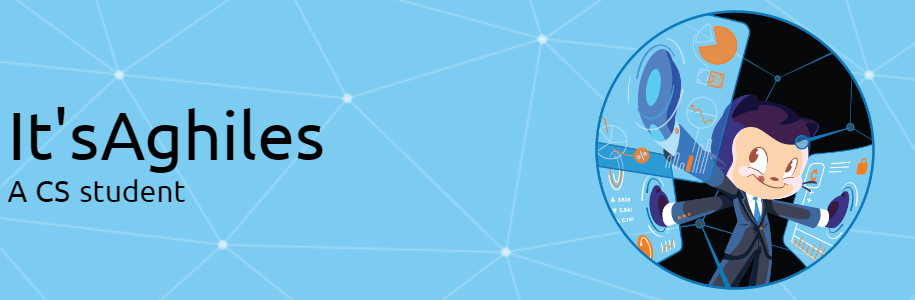

<h2 align="left">Hello there!👋</h2>

###

<h2 align="left">About me 🤓</h2>

###

  <ul>
    <li align="left">
    My name is Aghiles Tamendjari and I'm a computer science student and a web developer.👨‍💻
    </li>
    <li align="left">
    ✨ Creating bugs for three year now
    !</li>
  </ul>

###

<h2 align="left">programming languages</h2>

###

  
  
  
  
  
  
  
  
  

###

<h2 align="left">My tech-stack</h2>

###

  
  
  
  
  
  
  
  
  
  
  
  
  
  
  
  
  
  
  
  
  
  
  
  
  
  
  
  
  
  
  
  
  
  
  
  
  
  
  
  
  
  
  
  
  
  
  
  
  

###

<h2 align="left">Contact me 💬</h2>

  

###

